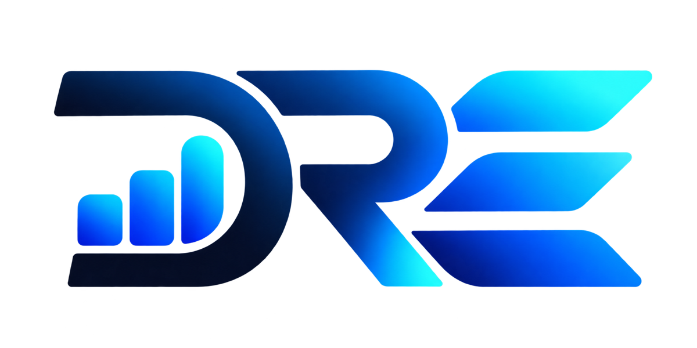

<p align="center">
  
</p>

# DRE

**DRE** stands for **Declarative Reporting Engine**.

DRE is SQL (plus a template) in, a correctly formatted file out. You declare reports as YAML and
`.sql` files in a dbt-shaped project. DRE runs the SQL against your warehouse, writes the result as
csv, delimited, fixed-width, parquet or xlsx (including multi-sheet workbooks, number formats,
formulas and totals rows, and branded Excel templates), and delivers the file wherever it needs
to go. It runs on whatever scheduler you already have: cron, Airflow, Dagster, Databricks Jobs.

Status: under active development. The pre-releases (`v0.0.1-alpha-<n>`) are for trying DRE out;
expect breaking changes.

## Install

macOS and Linux (x86_64 and ARM):

```bash
curl -fsSL https://raw.githubusercontent.com/allenhori/dre/master/install.sh | sh
```

This puts `dre` in `~/.local/bin`, after checking the download against the release's
`SHA256SUMS`. `DRE_INSTALL_DIR` picks another folder and `DRE_VERSION` a release (default: the
newest, pre-releases included):

```bash
curl -fsSL https://raw.githubusercontent.com/allenhori/dre/master/install.sh | DRE_VERSION=v0.1.0-rc.1 DRE_INSTALL_DIR=/usr/local/bin sh
```

The same line works in a Databricks job (a cluster init script or a `%sh` cell), a CI runner or a
container build. On Windows, download `dre-<version>-windows-x86_64.zip` (or `-aarch64.zip`)
from [Releases](https://github.com/allenhori/dre/releases) and put `dre.exe` on your `PATH`.

### With Homebrew or Scoop

From 0.1.0-rc.1 on:

```bash
brew install allenhori/tap/dre                                   # macOS and Linux
```

```powershell
scoop bucket add allenhori https://github.com/allenhori/scoop-bucket   # Windows
scoop install allenhori/dre
```

### With pip

The `dre-cli` package holds `dre` (Linux x86_64 and aarch64, macOS, Windows; Python 3.8+):

```bash
pip install dre-cli          # or: uv tool install dre-cli
dre --version
```

Each release attaches the wheels (`dre_cli-*.whl`), which install the same way with
`pip install <wheel URL>` before the version reaches PyPI. From Python, `dre_cli.run(["run",
"-s", "daily"])` runs `dre` and returns the finished process. In a Databricks job (serverless
included), add `dre-cli` to the job's environment dependencies and run `dre` from a script or
notebook.

### With cargo

```bash
cargo install dre-cli --locked          # builds `dre` from crates.io
```

A pre-release installs only when named: `cargo install dre-cli --locked --version 0.1.0-rc.1`.

### Plugins

However DRE is installed, only `dre` itself is. Every source, format and destination is a plugin
package with its own version and releases (`duckdb-v1.0.0`, `xlsx-v1.0.2`, ...): `dre init`,
`dre run`, `dre validate` and `dre compile` download the ones a project declares, from GitHub
Releases, and `dre.lock` pins them (see [the registry docs](docs/registry.md)). A plugin's
version doesn't follow DRE's: any DRE runs any plugin release that speaks its
[protocol](docs/protocol.md).

To have them in place before the first run, e.g. on a machine or job that starts empty each time:

- run `dre deps` in the project while building the image, or as its own CI or job step;
- or point `DRE_PLUGINS_DIR` at a folder that outlives the run (a Databricks Volume, a shared
  mount, a folder in the image) and run `dre deps` once to fill it.

### Updating

`dre system update` checks GitHub Releases and updates DRE the way it was installed.
`dre system update --check` only reports whether a newer release exists, and
`dre system update <version>` installs that release (to pin one, or to roll back):

- **install.sh or the release zip**: `dre` downloads the new release, checks it against the
  release's `SHA256SUMS`, and replaces its own binary. A failed update leaves the old one as it
  was. Plugins aren't touched; `dre plugin update` updates those.
- **Homebrew or Scoop**: `dre` changes nothing and prints `brew upgrade dre` or `scoop update dre`.
- **pip, uv or pipx**: `dre` changes nothing and prints the command to run:
  `<python> -m pip install -U dre-cli`, `uv tool upgrade dre-cli` or `pipx upgrade dre-cli`.
  If `dre-cli` is pinned in a project's or a Databricks job's dependencies, bump the pin there.
- **cargo**: `dre` changes nothing and prints the `cargo install` command for the new version.
- **A build of your own** (`cargo build`, `cargo install --path`): `dre` refuses to overwrite it.

While every release is a pre-release, "newest" includes pre-releases. Once there are stable
releases, a stable `dre` updates to the newest stable one. Only `dre system update` checks for
new versions; no other command calls the network for it. `GITHUB_TOKEN` is sent when set, which
avoids GitHub's anonymous rate limit on shared IPs and CI runners.

## Concepts

- **Report**: one or more Jinja-templated SQL queries plus an output config, declared in YAML.
  A `.sql` file under `reports/` with no YAML is an *unmanaged* report, meant for quick tests.
- **Set** and **Binding**: one report can run as many named variants (clients, regions,
  departments). A Binding is a report paired with a Set, with its own profile, variables, query
  subset and output.
- **Jinja everywhere**: SQL, paths and options render with `var()`, `env_var()`, `run.*` and your
  macros in `macros/`. `target.*` and `profile('name')` read connection settings, so names can
  follow the environment: `{{ target.catalog }}.{{ target.schema }}.orders`. `run.date` is a date
  you can navigate (`run.date.prev_month.start.date`), in the run's timezone (UTC unless you set
  one). `run_query()` and `columns()` let a macro query the report's own connection while
  rendering. `ref('file')` reuses another `.sql` file as a subquery. See
  [templates](docs/templates.md).
- **Lookups**: mapping tables you maintain as files in `lookups/` (csv, xlsx, xls, json, jsonl,
  yml) rather than in the database. `ref('countries')` makes one usable like a table: small ones
  are inlined into the SQL, larger ones (over 200 rows by default) are loaded into a temp table
  by the source plugin. `lookup('countries')` hands the rows to Jinja. Values are text unless a
  `lookups/<name>.yml` config gives columns types; see [lookups](docs/lookups.md).
- **Plugins**: every source, format and destination is a plugin that speaks DRE's
  [plugin protocol](docs/protocol.md). Plugins ship in packages, one per system: `databricks`
  is the Databricks source and destination, `object_store` is S3, GCS and Azure Blob. A project
  declares each package once and DRE installs it on demand.
- **Delivery**: one output can go to several destinations in a single run, e.g. object storage
  (S3, GCS, Azure Blob), SFTP/FTP, Databricks Volumes or workspace files, an email with the file
  attached, or a Slack channel. See [plugins](docs/plugins.md).
- **Logs**: every run appends to `logs/dre.log` in the project, including the full SQL of each
  statement sent to the database (report queries, `run_query()`, lookup loads). The file rotates
  every 10,000 lines, keeping `dre.log.1` to `dre.log.5`.
- **Verification**: `dre validate` checks the project and compiles its SQL; with `-s` it also shows,
  per selected Binding, the compiled files, the source and target, the output file and every
  destination (non-dev targets stand out). `dre compile` just renders the SQL into
  `target/compiled/` and lists the files. `dre validate --live` checks every statement against
  the database. `--preview` and schema-drift detection check a report before it reaches anyone.
- **Generated files**: everything DRE writes goes in the *target path*, `target/` in the project
  by default: compiled SQL, each run's output files, schema snapshots, `run_results.json` and the
  [manifest](docs/manifest.md). `--target-path`, `DRE_TARGET_PATH` or `target_path:` in
  `dre_project.yml` move it (see [below](#the-target-path)).
- **Selecting**: `run`, `compile`, `validate` and `ls` take report names, `tag:<tag>`, folder names
  or dotted folder paths, as arguments (`dre run daily monthly`) or with `-s`/`--select`. Several
  match any of them: `-s daily monthly`, `-s daily,monthly`, or repeated `-s` (a semicolon works
  too, quoted: `-s "daily;monthly"`).

## Quick start

```bash
dre init                 # pick a source, enter its connection, optionally start a project
cd my_reports
dre validate             # check the project and compile its SQL
dre validate -s monthly  # ...and show where monthly's output would go
dre compile -s daily,monthly       # render the SQL into target/compiled/ and list the files
dre run                  # run every report; output lands in target/run/
dre run monthly --preview 50       # sample 50 rows, never delivered
dre run -s tag:regulatory --set all  # every regulatory report, for every Set
dre validate --live      # check every statement against the database without running it
dre ls --schedule close_monthly    # list the Bindings a schedule runs (--output json for tools)
dre clean                # remove the target folder
dre system update        # update DRE itself
```

A report is a YAML file next to its `.sql` files:

```yaml
# reports/finance/monthly/monthly.yml
queries:
  - {query: setup_temp_accounts, tab: false}   # CREATE TEMP TABLE: runs first, no tab
  - {query: summary, tab_name: Summary}
  - detail
output:
  format: xlsx
  destination:
    profile: reports_s3
    path: "s3://reports/{{ var('client') }}/monthly-{{ run.date.yyyymmdd }}.xlsx"
sets: [client_a, client_b]
default_set: client_a
```

Queries run one after another in the order listed, on one database session, so a temp table
made by one is there for the next. Each `.sql` file makes one tab (a sheet in xlsx, or one file
for csv, parquet and the other single-table formats), named by `tab_name` or else the file's
name, in the same order. The YAML decides the tabs, not the data:

- A file can hold several statements; the last one is the tab and the earlier ones prepare data.
  A second `SELECT` in a tab file is an error: give each tab its own `.sql` file.
- `tab: false` runs a file only for what it does (temp tables, `SET`s) and discards any result.
- A tab whose query returns no rows still appears, with its column names.
- A tab file whose last statement returns no result set at all is an error that points at
  `tab: false`.

The output file is named after the report (`monthly.xlsx`), or after the first destination's
`path`. `extension:` changes the extension for text formats that feed other systems, e.g. a bank
file that must end in `.aba`, or drops it with `extension: ""`:

```yaml
output:
  format: fixed_width
  extension: aba          # payments.aba instead of payments.txt; "" for no extension
  columns: [...]
```

Connections live in `profiles.yml`. DRE looks for it, in order, in `--profiles-dir`,
`DRE_PROFILES_DIR`, the project directory (next to `dre_project.yml`), and `~/.dre`, the same order
as dbt; `dre validate` and `dre run -v` say which file they used. Database connections go under
`sources:` and delivery targets under `destinations:`. Each profile picks a default `target`
(environment) from its named `targets`:

```yaml
sources:
  warehouse:
    target: dev
    targets:
      dev: {type: duckdb, path: dev.duckdb}
      prod: {type: postgres, host: db.internal, user: reports, password: "{{ env_var('PG_PASSWORD') }}"}
destinations:
  reports_s3:
    target: prod
    targets:
      prod: {type: s3, bucket: reports}
```

`dre init` writes this file for you, in `~/.dre` (never into a project). A `profiles.yml` kept
in the project, e.g. for CI, a container or a Databricks job, should take every secret from
`env_var()` so nothing secret is committed.

Targets can share settings with YAML anchors and merge keys, in `profiles.yml` and every other
YAML file DRE reads; keys written out win over merged ones:

```yaml
sources:
  warehouse:
    target: dev
    targets:
      dev: &pg {type: postgres, host: db.internal, user: reports, database: shop}
      prod:
        <<: *pg
        database: shop_prod
```

Plugin packages and macro packages are declared in `dependencies.yml` (or `packages.yml`, or
both):

```yaml
plugins:
  - duckdb
  - xlsx
  - object_store      # the s3, gcs and azure_blob destinations
packages:
  - git: https://github.com/acme/finance_macros.git
    revision: v2.3.0
```

`dre run`, `dre validate` and `dre compile` install what's missing into the project's
`dre_deps/` folder before they start, so there's nothing to run first. `dre deps` installs
everything and refreshes the lock on purpose, e.g. as a separate CI step. Exact versions and
commits are pinned in `dre.lock`. Package macros are called through the package's name
(`{{ dre_utils.star(ref('customers'), except=['ssn']) }}`), and `dispatch()` lets a package offer per-database variants
that a project can override. See [the registry docs](docs/registry.md).

## Schedules

DRE doesn't fire schedules itself; your orchestrator does. `schedules.yml` names them, and one
report can have several, each with its own vars:

```yaml
- name: flash_daily
  report: sales_summary
  set: client_a
  cron: "0 7 * * *"
  vars: {period: day}
- name: close_monthly
  report: sales_summary
  set: client_a
  cron: "0 6 1 * *"
  vars: {period: month}
```

```bash
DRE_RUN_DATE=2026-09-01 dre run --schedule close_monthly
```

`--schedule` runs exactly the Bindings that schedule targets. Its `vars` sit above the report's and
below `--var`, and `run.schedule` renders as its name, so SQL can say
`...`. Pass the scheduled date through `DRE_RUN_DATE` so reruns
render the same. `run_results.json`, the JSON events and `logs/dre.log` record the schedule, its
vars, every var the run used and the command's parameters.

## The project manifest

`dre compile`, `dre validate` and `dre run` write `target/manifest.json`: the whole project as
DRE resolves it, whatever was selected. It lists every report with its Sets and Bindings (merged
vars, queries, output, destinations), every schedule with the Bindings it runs, the declared
plugins, and checksums for change detection. It's built offline, with no connection or
`profiles.yml`, never contains secrets or connection settings, and is the same byte for byte for
the same project. An orchestrator can generate one task per schedule from it (each runs
`dre run --schedule <name>`), and CI can compare two manifests to find the reports a change
touched. `dre ls` prints slices of it: `dre ls -s tag:regulatory`, `dre ls --schedule
close_monthly --output json`. See [the manifest](docs/manifest.md) and its
[JSON Schema](docs/manifest.schema.json).

## The target path

The target path is the folder DRE writes its generated files to. It has nothing to do with a
profile's `target` (the environment a connection uses). It's `target/` in the project unless set,
highest first, by:

1. `--target-path <path>` on `compile`, `validate`, `run`, `clean` and `ls`;
2. `DRE_TARGET_PATH`;
3. `target_path:` in `dre_project.yml`.

A relative path is relative to the project root, whichever of the three sets it; `~` is your home
directory. Compiled SQL, run outputs, schema snapshots, `run_results.json` and the manifest move
together. The path must be local or mounted: object storage URLs (`s3://`, `gs://`, `abfss://`)
are refused, but a filesystem mount that supports renames works, such as a Databricks Unity
Catalog Volume (`/Volumes/...` on Databricks compute), an NFS/EFS share or a gcsfuse mount. DRE
refuses a target path that is the project root, contains the project, or sits inside `reports/`,
`macros/`, `lookups/` or `dre_deps/`. A path elsewhere inside the project is skipped when DRE
reads the project; add it to `.gitignore` (a new project's `.gitignore` covers `target/` only).

Schema-drift detection compares each run with the snapshot the last successful run left in the
target path, so on an ephemeral runner (a job cluster, a CI runner) point it at a folder that
outlives the run:

```bash
dre run --schedule close_monthly --target-path /mnt/shared/dre/target
```

In a Databricks job, a Volume keeps the snapshots and the manifest between runs:

```bash
export DRE_TARGET_PATH=/Volumes/main/reporting/dre/target
dre run --schedule close_monthly
```

Give each job that runs at the same time its own target path; two runs sharing one overwrite
each other's files and snapshots. `dre clean` deletes the target folder only if DRE created it
(it leaves a `.dre_target` file there) or it's the project's own `target/`, so a mistyped
`--target-path` can't delete anything else.

## Environment variables

| Variable | Effect |
|---|---|
| `DRE_PROFILES_DIR` | Directory holding `profiles.yml` (default: the project directory if it has one, else `~/.dre`). `--profiles-dir` overrides it. |
| `DRE_PLUGINS_DIR` | One plugins directory for every project, instead of each project's `dre_deps/plugins`. |
| `DRE_REGISTRY_URL` | The plugin package registry index (a URL or a local path). |
| `DRE_TARGET_PATH` | Where DRE writes its generated files (default: `target/` in the project). `--target-path` overrides it; it overrides `target_path:` in `dre_project.yml`. |
| `GITHUB_TOKEN` | Sent to GitHub by `dre system update` and `github:` plugin sources (private repositories, rate limits). |
| `DRE_GITHUB_API_URL` | The GitHub API for `github:` plugin sources and `dre system update` (GitHub Enterprise, a mirror). |
| `DRE_RUN_DATE` | The run date (`YYYY-MM-DD`) behind `run.date`, instead of today. |
| `DRE_TIMEZONE` | The run's timezone (IANA name), above every `timezone:` setting. `--timezone` overrides it. |
| `DRE_LOG_MAX_LINES` | Lines per `logs/dre.log` before it rotates (default 10,000). |
| `DRE_PLUGIN_HANDSHAKE_TIMEOUT_MS` | How long to wait for a plugin to start (default 30,000). |
| `NO_COLOR` | Turns off coloured output. |
| `DRE_SECRET_*` | Values are masked as `*****` in the console, logs, JSON events, `run_results.json` and `target/compiled/` (`mask_secrets: false` in `dre_project.yml` turns this off). |

## Documentation

- [Templates: `target`, `profile()`, `columns()`, dates and timezones](docs/templates.md)
- [Lookups: files, typed columns, inline or temp table](docs/lookups.md)
- [Plugins and their profile fields](docs/plugins.md)
- [Plugin protocol](docs/protocol.md), for writing a plugin in any language
- [Plugin packages, the registry and `dre.lock`](docs/registry.md)
- [The manifest and `run_results.json`](docs/manifest.md), with the manifest's
  [JSON Schema](docs/manifest.schema.json)

## Building from source

Requires a recent stable Rust toolchain, and Go for the Databricks package.

```bash
cargo build --release
./target/release/dre --help
```

The first-party plugin packages are built from the same workspace
(`target/release/dre-plugin-*`), except the Databricks package in `go/databricks`:

```bash
cd go/databricks
go build -o ../../target/release/dre-plugin-databricks .
```

Put them in a project's `dre_deps/plugins/` (or point `DRE_PLUGINS_DIR` at them) to use them
without a registry.

## License

This project is licensed under the [GNU General Public License v3.0](LICENSE).

A commercial license — for embedding DRE into a product or service you distribute to third parties, without GPL's copyleft obligations — is also available. Contact the maintainer for details.
